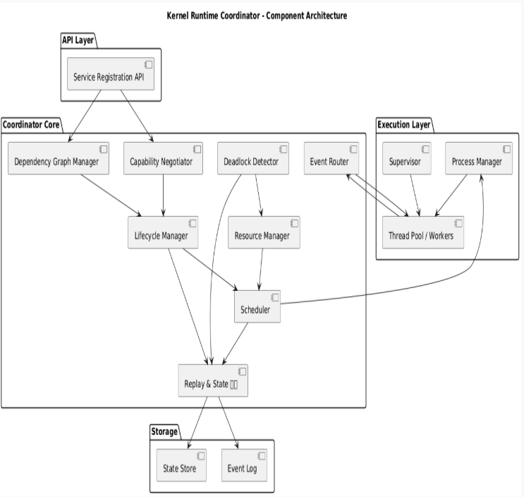

# Kernel Runtime Coordinator

### Technical Architecture & Execution Flow

---

## Overview

The Kernel Runtime Coordinator is a low-level orchestration system designed to manage services as **deterministic state machines** under an **event-driven control plane**, with an **append-only log as the single source of truth**.

The system emphasizes:

* Explicit state transitions
* Strong ownership boundaries
* Deterministic execution and replay
* Fault isolation and supervised recovery

This architecture draws conceptual parallels to systems such as Kubernetes and Erlang OTP, while operating at a lower level of abstraction with tighter control over execution semantics.

---


## Core Model

The system is defined by three foundational abstractions:

* **Service** → A state machine with explicit lifecycle transitions
* **Coordinator** → An event-driven control plane responsible for orchestration
* **Log** → An immutable, append-only record of all system events and state transitions

All runtime behavior is derived from event processing and can be reconstructed through replay.

---

## System Architecture

The runtime is decomposed into modular subsystems:

```
API Layer
  └── Service Registration Interface

Runtime Coordinator
  ├── Dependency Graph Manager
  ├── Lifecycle Manager
  ├── Scheduler (Processes / Threads / Workers)
  ├── Resource & Memory Manager
  ├── Deadlock Detection Engine
  ├── Event Router
  ├── Capability Negotiator
  └── Replay & State Log

Execution Layer
  ├── Process Manager
  ├── Supervisor
  └── Worker Pools

Storage Layer
  ├── Event Log (append-only)
  └── State Store
```

Each subsystem operates independently but communicates through structured events.

---

## Service Registration & Specification

Services are introduced into the system via a declarative specification:

Example:

```yaml
service: ServiceX
version: 2.1

dependencies:
  - AuthService >=2.0

resources:
  cpu: 2
  memory: 512MB

capabilities:
  - async-events
  - idempotent

lifecycle:
  restart: always
```

Upon registration, the specification is distributed across subsystems:

* Dependency Graph Manager → builds dependency DAG
* Scheduler → prepares execution plan
* Capability Negotiator → validates compatibility

---

## Dependency Resolution

Dependencies are modeled as a **Directed Acyclic Graph (DAG)**.

### Build-Time

* Perform topological ordering
* Detect and reject cyclic dependencies

### Runtime

* Track dynamic dependencies (e.g., service discovery)
* Construct a **wait-for graph** representing runtime resource dependencies

This graph becomes the foundation for deadlock detection.

---

## Execution Model

Each service instance is deployed as an isolated execution unit:

```
Service Instance
  ├── Supervisor
  ├── Worker Thread Pool
  └── Message Queue
```

### Responsibilities

* **Supervisor**

  * Monitors worker health
  * Enforces restart policies
  * Escalates repeated failures

* **Workers**

  * Execute tasks from the queue
  * Remain stateless or replayable

---

## Failure Handling & Recovery

Failure handling is intrinsic to the runtime.

### Requirements

* Workers must be **idempotent**
* State must be **recoverable via replay**

### Recovery Flow

```
Worker Failure
  → Supervisor Detection
  → Restart Worker
  → Replay Required State (if necessary)
```

### Restart Policies

* One-for-one
* One-for-all
* Backoff strategies

---

## Memory Ownership Model

The system enforces explicit memory boundaries.

### Process-Isolated Model (Default)

* One service instance per process
* Memory ownership is local and isolated
* Communication via IPC

### Shared Memory Model (Advanced)

* Requires strict ownership semantics
* Mechanisms:

  * Memory arenas
  * Reference counting / ownership transfer

**Guideline:**
Use process isolation by default; introduce shared memory only when performance constraints demand it.

---

## Event Routing

All inter-service communication is event-driven.

### Principles

* Asynchronous message passing
* Topic-based routing
* No direct blocking calls

### Pattern

```
Producer → Event Router → Consumer
```

### Benefits

* Reduced coupling
* Improved scalability
* Lower deadlock risk

---

## Deadlock Detection

The system continuously maintains a **wait-for graph**:

* Nodes → threads or services
* Edges → resource dependencies

### Detection

* Identify cycles via graph traversal

### Resolution Strategies

* Terminate lowest-priority participant
* Rollback transactional operations
* Apply preemption

---

## Deterministic Replay

The runtime supports full system reconstruction via replay.

### Recorded Data

* Input events
* Scheduling decisions
* State transitions

### Constraints

* Time must be controlled or recorded
* Randomness must be deterministic
* Thread scheduling must be reproducible or logged

### Outcomes

* Debugging of production failures
* Exact reproduction of execution paths
* Auditable system behavior

---

## Capability Negotiation

Services establish compatibility at bind time.

### Model

```
Service A requires → [features, versions]
Service B provides → [features, versions]
```

### Resolution

* Match → binding established
* Partial match → downgrade
* No match → rejection

---

## Lifecycle Management

Each service operates as a state machine:

```
Registered → Resolved → Starting → Running
→ Degraded → Restarting → Stopped
```

### Transition Triggers

* Health checks
* Dependency changes
* Resource constraints

All transitions are explicitly logged.

---

## Resource Management

The runtime enforces resource constraints across:

* CPU
* Memory
* File descriptors
* Synchronization primitives

### Control Mechanisms

* Quotas
* Backpressure
* Admission control

---

## State Logging

Every state transition is captured:

```
[timestamp] ServiceA: STARTING → RUNNING
[timestamp] Worker#3: FAILED → RESTARTED
```

### Properties

* Append-only
* Immutable
* Globally ordered (if required)

### Use Cases

* Debugging
* Replay
* Compliance and auditing

---

## End-to-End Execution Flow

1. Service registration
2. Dependency validation (DAG resolution)
3. Capability negotiation
4. Resource allocation
5. Process instantiation
6. Supervisor and worker initialization
7. Event routing begins
8. Continuous monitoring:

   * failures
   * deadlocks
   * resource utilization
9. State transitions logged
10. Recovery and rescheduling as required


---

## Design Considerations

The primary complexity lies in **defining correct system boundaries**.

Poor boundary definition results in:

* Increased deadlock probability
* Non-deterministic execution
* Inability to replay state
* Degraded scalability

---

## Summary

The Kernel Runtime Coordinator models execution as:

> A network of state machines coordinated through events, with all behavior derived from and reproducible via an append-only log.

This approach prioritizes correctness, observability, and deterministic behavior over implicit or ad hoc orchestration.

---
